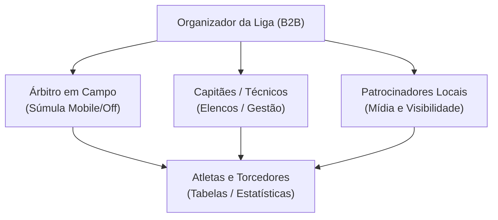
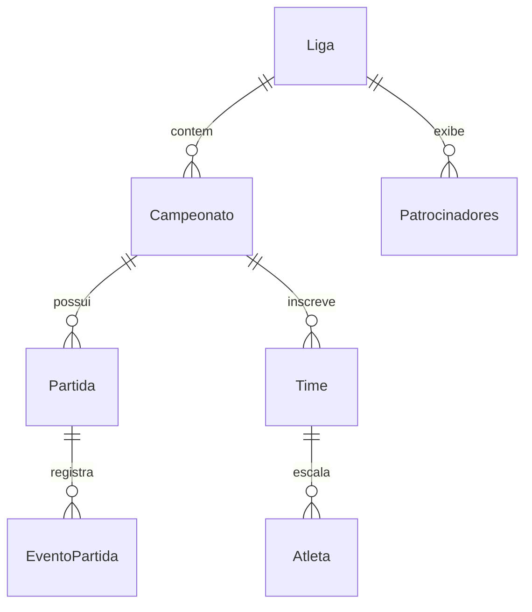

# 🏆 Plataforma de Gestão de Ligas e Campeonatos Esportivos Amadores

Uma plataforma digital **B2B2C** projetada para modernizar a gestão do esporte amador, substituindo o ecossistema fragmentado de planilhas de Excel, anotações em papel e grupos de WhatsApp por uma solução integrada, escalável e agnóstica ao esporte (com piloto inicial focado em **Futebol e Futsal**).

---

## 📌 Visão Geral do Produto

O organizador de campeonatos amadores atua como o cliente pagante principal, enquanto administradores de equipes, atletas, árbitros, torcedores e patrocinadores locais utilizam a plataforma como usuários do ecossistema esportivo.

## 🎯 Escopo do MVP: É / Não É / Faz / Não Faz

| Dimensão          | Definição                                                                                                                                                                                                                                                                                                                                                                                                                                                       |
| :----------------- | :---------------------------------------------------------------------------------------------------------------------------------------------------------------------------------------------------------------------------------------------------------------------------------------------------------------------------------------------------------------------------------------------------------------------------------------------------------------- |
| **É**       | • Plataforma de gestão de campeonatos e ligas amadoras.• Substituto digital para a combinação planilha + WhatsApp.• Ferramenta B2B2C (organizador paga, comunidade usa).• Sistema com modelo de dados agnóstico (futebol/futsal no piloto).• Vitrine digital para divulgação de marcas locais.                                                                                                                                                         |
| **Não é**  | • Rede social esportiva genérica.• Sistema de streaming/transmissão ao vivo.• Plataforma de apostas ou fantasy game.• ERP esportivo completo (folha de pagamento, contratos, fiscal).• Aplicativo de agendamento/reserva de quadras avulsas.                                                                                                                                                                                                               |
| **Faz**      | • Gera automaticamente tabela de classificação e calendário de confrontos.• Súmula digital móvel com cálculo automático de suspensões por cartões.• Gerenciamento de inscrições de times, atletas e comissões técnicas.• Controle financeiro básico (taxas de inscrição e prestação simples).• Controle de acesso por papéis (Organizador, Capitão, Árbitro).• Exibição de marcas patrocinadoras nas páginas do torneio e súmulas. |
| **Não faz** | • Emissão de notas fiscais ou contabilidade avançada.• Substituição do julgamento do árbitro em campo.• Rastreamento por vídeo ou estatísticas avançadas por IA.• Gestão jurídica de contratos de patrocínio.                                                                                                                                                                                                                                      |

---

## 👥 Segmentos de Clientes & Stakeholders

* **Organizadores de Ligas e Campeonatos:** Clientes pagantes que buscam eliminar o trabalho operacional manual e profissionalizar a competição.
* **Patrocinadores e Marcas Locais:** Negócios locais que financiam os eventos em troca de presença digital estruturada e mensurável.
* **Administradores de Times (Capitães/Técnicos):** Responsáveis por gerenciar elencos, acompanhar suspensões e auditar súmulas.
* **Atletas Amadores:** Jogadores que buscam acompanhar seus gols, cartões e histórico pessoal em tempo real.
* **Árbitros da Competição:** Operadores de campo responsáveis pelo registro ágil e sem papel dos eventos da partida.
* **Torcedores e Comunidade Local:** Consumidores de conteúdo público que acompanham os resultados e a classificação do time do bairro.

---

## 🧭 Jobs to be Done (JTBD) — Resumo

* **Organizador:** *“Quando estou gerenciando um campeonato, quero que as tabelas e suspensões sejam calculadas automaticamente a partir das regras cadastradas, para que eu não perca horas corrigindo planilhas nem seja cobrado por erros manuais.”*
* **Árbitro:** *“Quando estou apitando rodadas consecutivas, quero preencher e enviar a súmula diretamente pelo celular, para que eu elimine relatórios em papel sujeitos a perdas e rasuras.”*
* **Capitão:** *“Antes de cada rodada, quero verificar com clareza quais atletas estão suspensos, para que meu time não cometa erros de escalação e perca pontos na justiça desportiva.”*
* **Atleta:** *“Após o término da partida, quero consultar meus gols e histórico atualizados em um link público, para que eu possa acompanhar e compartilhar meu desempenho.”*
* **Patrocinador:** *“Durante toda a temporada, quero que minha marca apareça vinculada às páginas e súmulas oficiais, para que meu investimento tenha visibilidade digital comprovada na comunidade.”*

---

## 🛠️ Arquitetura e Modelo de Dados Agnóstico

A plataforma foi projetada para suportar diferentes modalidades esportivas através de um modelo de eventos configurável:

### Principais Entidades:

* `Ligas`: Ligas ou entidades organizadoras.
* `Campeonatos`: Edições de campeonatos com regras específicas de pontuação e desempate.
* `Times` & `Atletas`: Cadastro e relacionamento de elencos por edição.
* `Partidas`: Confrontos com local, data, árbitro designado e status.
* `EventosPartida`: Eventos atômicos em campo (gols, cartões amarelos/vermelhos, substituições).
* `Patrocinadores`: Banners e marcas vinculadas a campeonatos e súmulas.

---

## 🚀 Próximos Passos do Roadmap

- [X] Definição de Escopo (É / Não É / Faz / Não Faz)
- [X] Mapeamento de Empatia dos 6 Stakeholders
- [X] Problem-Solution Fit Canvas e Jobs to be Done
- [ ] Especificação Técnica dos Casos de Uso do MVP (Súmula Offline-First)
- [ ] Prototipação UI/UX das Páginas Públicas e Módulo do Árbitro
- [ ] Implementação do Backend e Modelagem Relacional do Banco de Dados
